# Symfony Monitor

A docker solution to monitor Symfony and Apache or Nginx with ELK.

## How to start

To start building your monitoring dashboards thanks to [Kibana](https://www.elastic.co/products/kibana), follow these steps:

* Clone this repository or create your own [docker-compose.yml](docker-compose.yml) file.

```yaml
elk:
  image: ypereirareis/elk
  ports:
    - 8200:9200
    - 4601:5601

forwarder:
  image: ypereirareis/logstash-forwarder
  links:
    - elk
```

Change the ports mapping if needed.
The `links` configuration of the `forwarder` is very important !

* Add volumes matching your Apache/Nginx and Symfony logs directories to the `forwarder` container:

```yaml
forwarder:
  ...
  volumes:
    - APACHE_ACCESS_ERROR_LOG_DIR/:/var/log/forwarder/apache
    - NGING_ACCESS_ERROR_LOG_DIR/:/var/log/forwarder/nginx
    - SYMFONY_PROD_DEV_LOG_DIR/:/var/log/forwarder/symfony
```

* Start the containers with `make start` or `docker-compose up -d elk forwarder`
    * ELK and logstah-forwarder startup can take a few seconds.
    * You can use `make logs` to see startup logs.

* Check elastic(search) status [http://127.0.0.1:8200](http://127.0.0.1:8200)

* Access the Kibana home page [http://127.0.0.1:4601](http://127.0.0.1:4601)

## Data/indexes persistence

If you want to persist all your work and configuration even if your remove your containers,
just map a volume to the `elk` container:

```yaml
elk:
  image: ypereirareis/elk
  ...
  volumes:
    HOST_PATH_TO_STORE_ELASTICSEARCH_CONF/:/var/lib/elasticsearch
```

## Docker images

This monitoring project is built thanks to two docker images:

* [docker-elk](https://github.com/ypereirareis/docker-elk)
* [docker-logstash-forwarder](https://github.com/ypereirareis/docker-logstash-forwarder)


## Kibana

To see the Kibana UI go to [http://127.0.0.1:4601](http://127.0.0.1:4601) once containers are started.
If everything is OK, you'll see this interface:

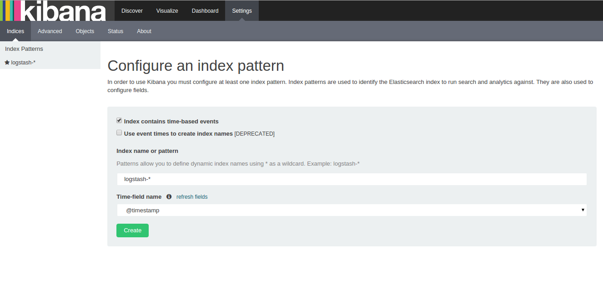

Click on the **Create** button because default configurations should be OK.
You will then arrive on this screen:

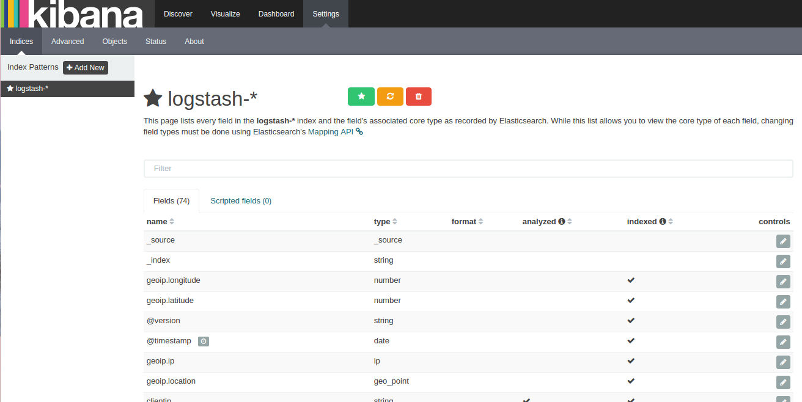

You do NOT need to do anything here unless you are an advanced user.
Once again default configurations will be OK to start.

So go create your first visualization by clicking the **Visualize** section in the header.


### Visualizations

I am gonna show you how to build your first (or two) dead simple visualizations here.
Then will see how to add it (or them) in a dashboard.

#### First visualization

* Choose the type of vsualization you want => Choose **Metric**

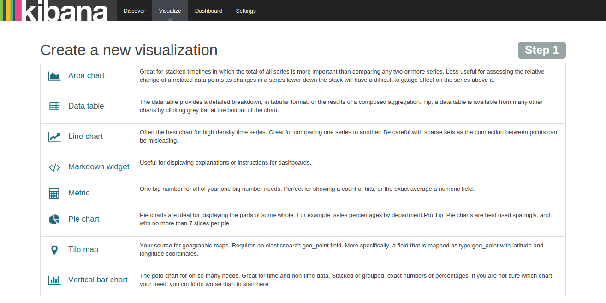

* Select a search source => Select **From a new search**


* The visualization screen, you can see the total number of log line in your logs files.

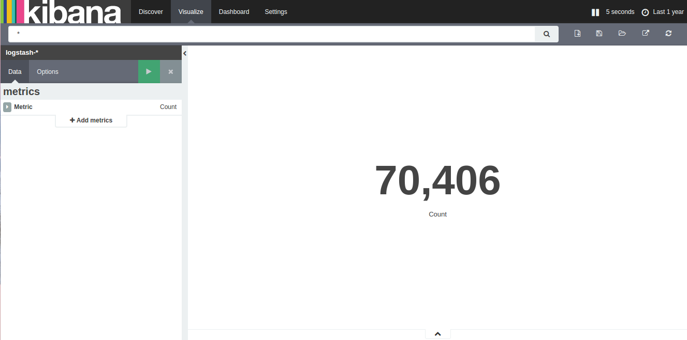

* Save this visualization clicking on the **save** button and give it a name.

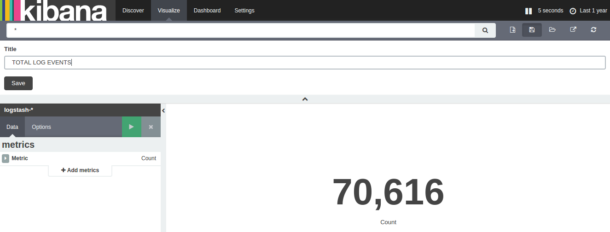

#### Second visualization

* Repeat the previous steps and choose a **Pie chart** visualization type

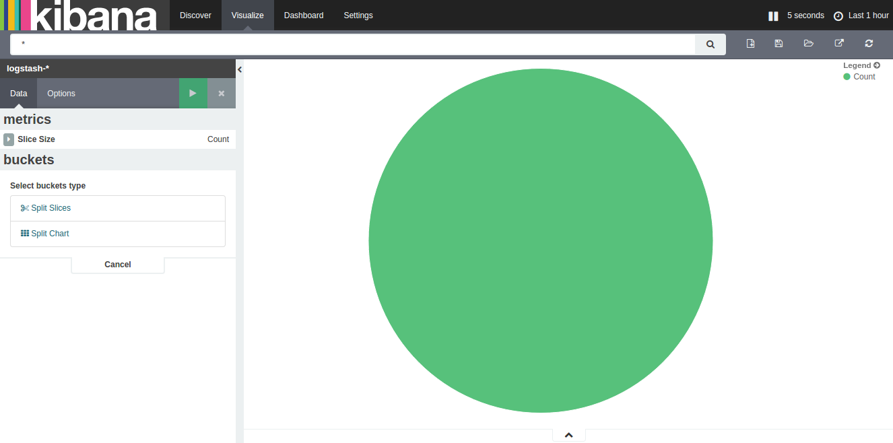

* Add an aggregation configuration to have a repartition by log types (request, doctrine,...)

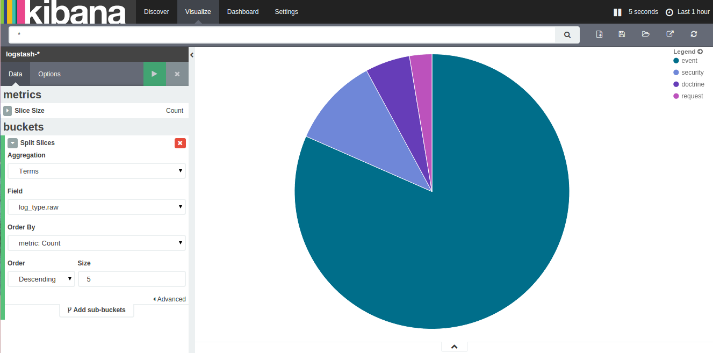

* Save this visualization clicking on the **save** button and give it a name.

### Dashboards

* Click on the **Dashboard** section in the header, then on the **Add visualization** button (+)

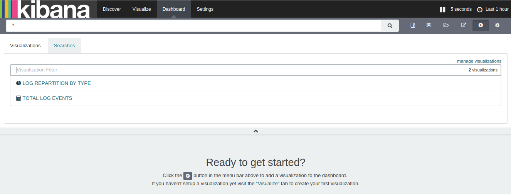

* Add the previously saved visualizations


* Save your dashboard

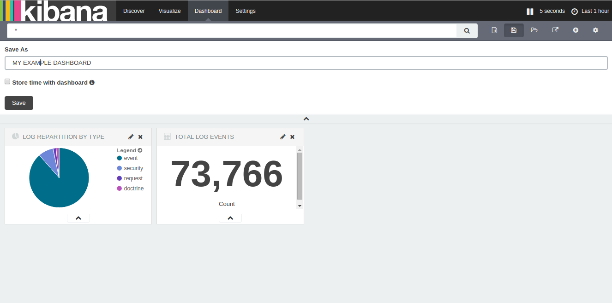

### Filters / DSL Query

On visualizations and on dashboard you can use [Query string query](https://www.elastic.co/guide/en/elasticsearch/reference/current/query-dsl-query-string-query.html)
to build filters and more complex monitoring.

* The input field for **Query String Query**

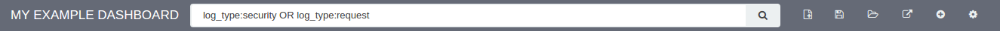

* Visualisation filters

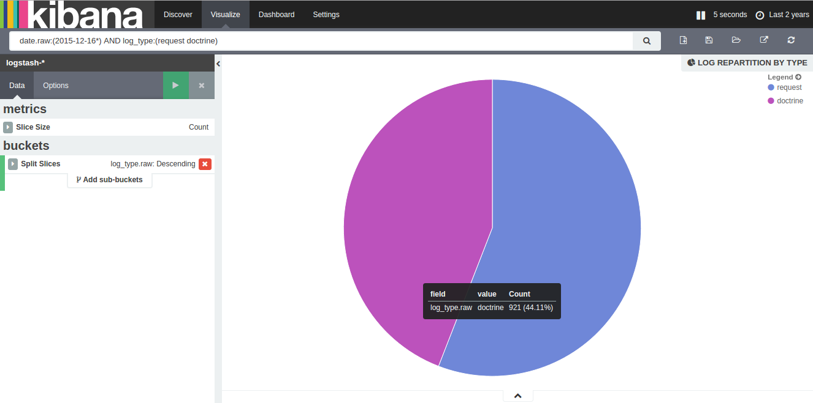

* Dashboard filters

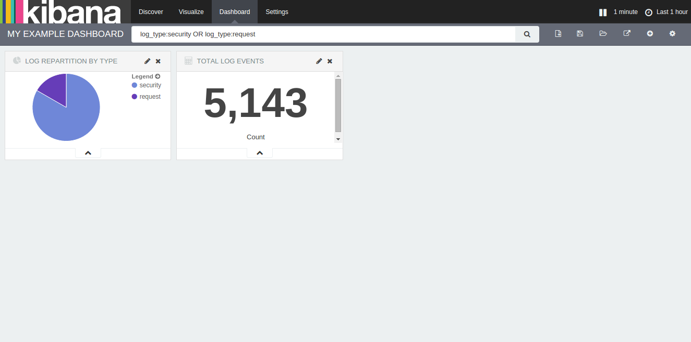